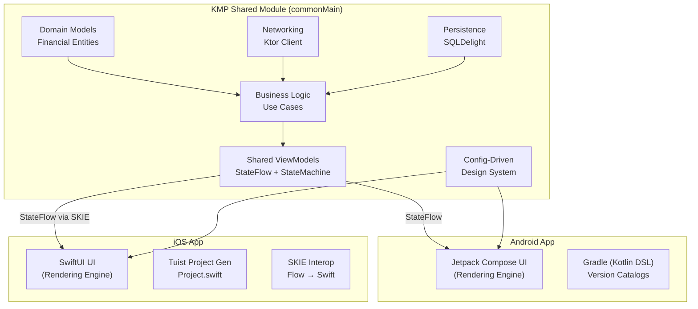

# BudgetQuest: KMP Gamified Finance App — Native Client Development Plan

> **Source**: NotebookLM Notebook — *"The 2026 Mobile Subscription Economy: Growth, Architecture, and Retention"*
> **Note**: *"BudgetQuest: KMP Gamified Finance App Technical Specification"*

---

## Goal

Build **BudgetQuest** — a cross-platform, gamified budgeting & savings tracker using **Kotlin Multiplatform (KMP)** with 100% native UIs (Jetpack Compose on Android, SwiftUI on iOS). The architecture follows a **Config-Driven Design System** pattern to share ~70% of code (business logic, networking, persistence, UI intent) while maintaining pixel-perfect native rendering.

## User Review Required

> [!IMPORTANT]
> **Monetization Strategy**: The spec defaults to **Freemium** with strict feature gating (2.1% conversion). RevenueCat 2026 data shows hard paywalls convert at 5x the rate (10.7%). Should we implement a **Reverse Trial** strategy instead — granting temporary premium access after paywall dismissal to trigger loss aversion?

> [!IMPORTANT]
> **Backend Provider**: The spec lists Supabase or Firebase. Which BaaS do you prefer? This affects auth, database, and edge function setup.

> [!WARNING]
> **Plaid API**: Bank syncing via Plaid requires a paid developer account and compliance review. Should we defer Plaid integration to Phase 5 (post-MVP)?

---

## Architecture Overview



---

## Proposed Changes

### Phase 1: Monorepo Initialization & Tooling

#### [NEW] Root Project Structure

```
BudgetQuest/
├── build.gradle.kts              # Root build file
├── settings.gradle.kts           # Module inclusion
├── gradle.properties             # KMP config flags
├── gradle/
│   └── libs.versions.toml        # Centralized dependency catalog
├── shared/                       # KMP shared module
│   ├── build.gradle.kts
│   └── src/
│       ├── commonMain/
│       ├── commonTest/
│       ├── androidMain/
│       └── iosMain/
├── androidApp/                   # Android native app
│   ├── build.gradle.kts
│   └── src/main/
├── iosApp/                       # iOS native app
│   ├── Project.swift             # Tuist manifest
│   ├── Tuist/
│   └── Sources/
├── .gitignore                    # Excludes *.xcodeproj, *.xcworkspace
└── README.md
```

**Key decisions:**
- `libs.versions.toml` for type-safe, centralized dependency management across all modules
- `.gitignore` excludes `*.xcodeproj` and `*.xcworkspace` — generated on-demand by Tuist
- Single Git monorepo to maximize code sharing and atomic commits

---

### Phase 2: KMP Shared Module — Core Architecture

#### [NEW] `shared/src/commonMain/` — Domain Layer

| File | Purpose |
|------|---------|
| `domain/model/Transaction.kt` | Financial transaction entity |
| `domain/model/Budget.kt` | Budget category with spending limits |
| `domain/model/SavingsGoal.kt` | Visual goal with progress tracking |
| `domain/model/UserProfile.kt` | User + gamification stats (streaks, XP, level) |
| `domain/model/Quest.kt` | Gamification quest/challenge definition |
| `domain/usecase/AddTransactionUseCase.kt` | Create & categorize transactions |
| `domain/usecase/CalculateBudgetUseCase.kt` | Compute remaining budget per category |
| `domain/usecase/TrackStreakUseCase.kt` | Daily streak calculation + XP rewards |
| `domain/usecase/GetQuestsUseCase.kt` | Fetch active quests with completion status |
| `domain/repository/TransactionRepository.kt` | Interface — swappable data source |
| `domain/repository/BudgetRepository.kt` | Interface — swappable data source |

#### [NEW] `shared/src/commonMain/` — Data Layer

| File | Purpose |
|------|---------|
| `data/remote/BudgetQuestApi.kt` | Ktor HTTP client for BaaS REST API |
| `data/remote/dto/*.kt` | Network DTOs with kotlinx.serialization |
| `data/local/BudgetQuestDatabase.sq` | SQLDelight schema for offline-first caching |
| `data/local/TransactionDao.kt` | SQLDelight-generated DAO |
| `data/repository/TransactionRepositoryImpl.kt` | Offline-first: cache → network sync |
| `data/repository/BudgetRepositoryImpl.kt` | Offline-first implementation |

#### [NEW] `shared/src/commonMain/` — Presentation Layer (Config-Driven)

The **Config-Driven Design System** pattern moves ALL UI logic into shared ViewModels. Platforms are "dumb" rendering engines.

```kotlin
// shared/src/commonMain/presentation/dashboard/DashboardContract.kt

data class DashboardConfig(
    val greeting: String,
    val streakDays: Int,
    val streakBadgeVisible: Boolean,
    val xpProgress: Float,          // 0.0 to 1.0
    val currentLevel: Int,
    val budgetSummaries: List<BudgetCardConfig>,
    val activeQuests: List<QuestCardConfig>,
    val savingsGoalProgress: Float,
    val isPremiumUser: Boolean,
    val showUpgradePrompt: Boolean
)

sealed class DashboardEvent {
    object OnScreenLoaded : DashboardEvent()
    data class OnQuestTapped(val questId: String) : DashboardEvent()
    object OnAddTransactionTapped : DashboardEvent()
    object OnUpgradeTapped : DashboardEvent()
}
```

```kotlin
// shared/src/commonMain/presentation/dashboard/DashboardViewModel.kt

class DashboardViewModel(
    private val trackStreak: TrackStreakUseCase,
    private val getBudgets: CalculateBudgetUseCase,
    private val getQuests: GetQuestsUseCase
) : StateMachine<DashboardConfig, DashboardEvent> {

    private val _state = MutableStateFlow(DashboardConfig.initial())
    override val state: StateFlow<DashboardConfig> = _state.asStateFlow()

    override fun onEvent(event: DashboardEvent) {
        when (event) {
            is DashboardEvent.OnScreenLoaded -> loadDashboard()
            is DashboardEvent.OnQuestTapped -> navigateToQuest(event.questId)
            is DashboardEvent.OnAddTransactionTapped -> showTransactionSheet()
            is DashboardEvent.OnUpgradeTapped -> showPaywall()
        }
    }
}
```

**Key ViewModels to implement:**

| ViewModel | Config | Purpose |
|-----------|--------|---------|
| `DashboardViewModel` | `DashboardConfig` | Main hub: streaks, XP, budgets, quests |
| `TransactionViewModel` | `TransactionConfig` | Add/edit transactions with categorization |
| `BudgetViewModel` | `BudgetConfig` | Category-level spending vs. limits |
| `SavingsGoalViewModel` | `SavingsGoalConfig` | Visual goal progress + milestones |
| `QuestViewModel` | `QuestConfig` | Active challenges + completion rewards |
| `ProfileViewModel` | `ProfileConfig` | Gamification stats, avatar, settings |
| `OnboardingViewModel` | `OnboardingConfig` | Self-select personalization flow |
| `PaywallViewModel` | `PaywallConfig` | Freemium gating + subscription offers |

---

### Phase 3: Android Client — Jetpack Compose

#### [NEW] `androidApp/src/main/`

The Android app is a pure rendering engine that observes `StateFlow` from shared ViewModels:

```kotlin
// androidApp/.../dashboard/DashboardScreen.kt

@Composable
fun DashboardScreen(viewModel: DashboardViewModel = koinViewModel()) {
    val config by viewModel.state.collectAsStateWithLifecycle()

    Scaffold {
        LazyColumn {
            item { GreetingHeader(config.greeting, config.streakDays) }
            item { XPProgressBar(config.xpProgress, config.currentLevel) }
            item { QuestCarousel(config.activeQuests) { quest ->
                viewModel.onEvent(DashboardEvent.OnQuestTapped(quest.id))
            }}
            items(config.budgetSummaries) { budget ->
                BudgetCard(budget)
            }
            if (config.showUpgradePrompt) {
                item { PremiumUpgradeBanner {
                    viewModel.onEvent(DashboardEvent.OnUpgradeTapped)
                }}
            }
        }
    }
}
```

**Key files:**

| File | Purpose |
|------|---------|
| `ui/theme/BudgetQuestTheme.kt` | Material3 theme with gamified color palette |
| `ui/dashboard/DashboardScreen.kt` | Main dashboard composable |
| `ui/transaction/TransactionScreen.kt` | Add/edit transaction flow |
| `ui/budget/BudgetScreen.kt` | Budget overview with progress bars |
| `ui/goals/SavingsGoalScreen.kt` | Visual savings goal progress |
| `ui/quests/QuestScreen.kt` | Active quests + reward animations |
| `ui/onboarding/OnboardingScreen.kt` | Self-select personalization (3 screens) |
| `ui/paywall/PaywallScreen.kt` | Scrollable, text-heavy premium offer |
| `ui/components/*.kt` | Reusable: XP bar, streak badge, quest card |
| `navigation/BudgetQuestNavGraph.kt` | Compose Navigation graph |
| `di/AndroidModule.kt` | Koin DI module for Android-specific deps |

---

### Phase 4: iOS Client — SwiftUI + Tuist + SKIE

#### [NEW] `iosApp/Project.swift` — Tuist Manifest

```swift
import ProjectDescription

let project = Project(
    name: "BudgetQuest",
    targets: [
        .target(
            name: "BudgetQuest",
            destinations: .iOS,
            product: .app,
            bundleId: "com.budgetquest.app",
            infoPlist: .extendingDefault(with: [:]),
            sources: ["Sources/**"],
            resources: ["Resources/**"],
            dependencies: [
                .xcframework(path: "../shared/build/XCFrameworks/release/shared.xcframework")
            ]
        )
    ]
)
```

#### [NEW] `iosApp/Sources/` — SwiftUI Rendering

With **SKIE**, Kotlin `StateFlow` is natively consumable in SwiftUI:

```swift
// iosApp/Sources/Dashboard/DashboardView.swift

import SwiftUI
import shared  // KMP framework

struct DashboardView: View {
    @StateObject private var viewModel = DashboardViewModelWrapper()

    var body: some View {
        ScrollView {
            VStack(spacing: 16) {
                GreetingHeader(
                    greeting: viewModel.config.greeting,
                    streakDays: viewModel.config.streakDays
                )
                XPProgressBar(
                    progress: viewModel.config.xpProgress,
                    level: viewModel.config.currentLevel
                )
                QuestCarousel(quests: viewModel.config.activeQuests) { quest in
                    viewModel.onEvent(.onQuestTapped(questId: quest.id))
                }
                ForEach(viewModel.config.budgetSummaries) { budget in
                    BudgetCard(config: budget)
                }
                if viewModel.config.showUpgradePrompt {
                    PremiumUpgradeBanner {
                        viewModel.onEvent(.onUpgradeTapped)
                    }
                }
            }
        }
    }
}
```

**Key files:**

| File | Purpose |
|------|---------|
| `Sources/App/BudgetQuestApp.swift` | App entry point + DI setup |
| `Sources/Theme/BudgetQuestTheme.swift` | SwiftUI design tokens |
| `Sources/Dashboard/DashboardView.swift` | Main dashboard |
| `Sources/Transaction/TransactionView.swift` | Add/edit transactions |
| `Sources/Budget/BudgetView.swift` | Budget overview |
| `Sources/Goals/SavingsGoalView.swift` | Visual savings progress |
| `Sources/Quests/QuestView.swift` | Quests + reward UI |
| `Sources/Onboarding/OnboardingView.swift` | Self-select personalization |
| `Sources/Paywall/PaywallView.swift` | RevenueCat paywall |
| `Sources/Components/*.swift` | Reusable: XP bar, streak badge |
| `Sources/Wrappers/ViewModelWrappers.swift` | SKIE-powered StateFlow observers |

---

### Phase 5: Gamification Engine (Shared)

| Feature | Implementation |
|---------|----------------|
| **Daily Streaks** | `TrackStreakUseCase` — increment on daily app open + transaction logged |
| **XP System** | Award XP for: adding transactions (10 XP), staying under budget (50 XP), completing quests (100 XP) |
| **Level Progression** | XP thresholds: L1=0, L2=500, L3=1500, L5=5000 — unlock avatar customizations |
| **Quest System** | Weekly challenges: "No Coffee Week" (-$30 saved), "Pack Lunch 5 Days" |
| **Savings Milestones** | Visual celebrations at 25%, 50%, 75%, 100% of savings goal |
| **Achievement Badges** | "First Budget" 🏅, "7-Day Streak" 🔥, "Savings Master" 💰 |

---

### Phase 6: Monetization — RevenueCat Integration

**Free Tier** (strict gating per spec):
- Basic expense categorization
- 1 active savings goal
- Standard daily streak tracking

**Premium Tier** ($4.99/mo or $39.99/yr):
- Unlimited savings goals
- Automated bank syncing (Plaid)
- Advanced AI behavioral insights
- Custom avatars + premium challenges

**Implementation:**
- RevenueCat SDK in both `androidMain` and `iosMain`
- Shared `PaywallViewModel` controls gate logic
- Scrollable paywall with "Continue" CTA (2026 best practice)
- Paid intro offer: $0.99 first month → auto-renew at standard price
- Annual plans presented prominently (2x higher RPI than monthly)

---

### Phase 7: Onboarding Flow

Based on 2026 best practices from the notebook:

| Screen | Pattern | Content |
|--------|---------|---------|
| 1 | Self-Select Personalization | "What's your #1 financial goal?" (Save, Budget, Pay Debt) |
| 2 | Self-Select Personalization | "How much do you earn monthly?" (Ranges) |
| 3 | Quick Win | Auto-generate first budget + quest → immediate achievement badge |
| 4 | Value Demonstration | Show personalized dashboard preview with gamification |
| 5 | Paywall (Reverse Trial) | Grant 7-day premium access → loss aversion drives conversion |

---

## Dependency Catalog (`libs.versions.toml`)

```toml
[versions]
kotlin = "2.1.0"
kmp = "2.1.0"
compose = "1.7.0"
ktor = "3.0.0"
sqldelight = "2.0.2"
koin = "4.0.0"
skie = "0.10.0"
revenuecat = "8.0.0"
coroutines = "1.9.0"
serialization = "1.7.0"

[libraries]
ktor-client-core = { module = "io.ktor:ktor-client-core", version.ref = "ktor" }
ktor-client-content-negotiation = { module = "io.ktor:ktor-client-content-negotiation", version.ref = "ktor" }
ktor-serialization-json = { module = "io.ktor:ktor-serialization-kotlinx-json", version.ref = "ktor" }
sqldelight-runtime = { module = "app.cash.sqldelight:runtime", version.ref = "sqldelight" }
sqldelight-coroutines = { module = "app.cash.sqldelight:coroutines-extensions", version.ref = "sqldelight" }
koin-core = { module = "io.insert-koin:koin-core", version.ref = "koin" }
koin-android = { module = "io.insert-koin:koin-android", version.ref = "koin" }
coroutines-core = { module = "org.jetbrains.kotlinx:kotlinx-coroutines-core", version.ref = "coroutines" }
serialization-json = { module = "org.jetbrains.kotlinx:kotlinx-serialization-json", version.ref = "serialization" }

[plugins]
kotlin-multiplatform = { id = "org.jetbrains.kotlin.multiplatform", version.ref = "kotlin" }
kotlin-serialization = { id = "org.jetbrains.kotlinx.serialization", version.ref = "kotlin" }
sqldelight = { id = "app.cash.sqldelight", version.ref = "sqldelight" }
skie = { id = "co.touchlab.skie", version.ref = "skie" }
```

---

## Open Questions

> [!IMPORTANT]
> 1. **Supabase vs Firebase** — Which BaaS should we provision? Supabase offers PostgreSQL (better for financial data), Firebase offers tighter Android integration.

> [!IMPORTANT]
> 2. **Reverse Trial vs Standard Freemium** — The notebook data strongly suggests reverse trials drive higher conversion via loss aversion. Should we implement this instead of strict freemium gating?

> [!WARNING]
> 3. **Plaid API Timeline** — Should Plaid bank syncing be deferred to post-MVP since it requires compliance review and paid developer access?

---

## Verification Plan

### Automated Tests
- `commonTest/` — Unit tests for all Use Cases, ViewModels (event → state transitions), and Repository logic
- Run: `./gradlew :shared:allTests`
- Android: `./gradlew :androidApp:testDebugUnitTest`
- iOS: `tuist generate && xcodebuild test -scheme BudgetQuest -destination 'platform=iOS Simulator,name=iPhone 16'`

### Build Verification
- ✅ **Android Build Verified**: Ran `./gradlew :androidApp:assembleDebug` successfully. All KMP shared logic, SQLDelight drivers, and Compose UI compile correctly.

### Manual Verification
- Run Android app on emulator — verify dashboard, streak tracking, quest flow
- Run iOS app on simulator — verify SKIE interop, StateFlow observation in SwiftUI
- Verify paywall flow end-to-end with RevenueCat sandbox
- Confirm `.xcodeproj` is NOT committed to Git (generated by Tuist)

### Version Control Updates
- ✅ Initialized Git repository, created `.gitignore`, and staged initial files for GitHub upload to `VaisGi/BudgetQuest`.
