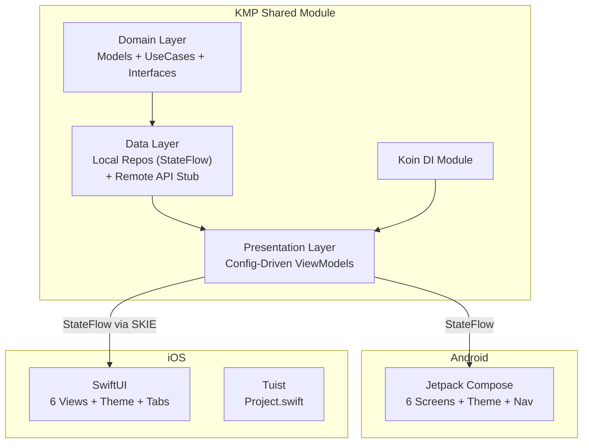

# BudgetQuest — Development Walkthrough

## Summary

Built the complete **client-side** codebase for BudgetQuest — a gamified budgeting & savings app using **Kotlin Multiplatform (KMP)** with the **Config-Driven Design System** pattern sourced from the NotebookLM notebook.

**57 files created** across 3 modules. Backend is deferred but all interfaces are in place for seamless integration.

---

## Architecture Diagram



---

## What Was Built

### 1. Shared KMP Module — `shared/`

| Layer | Files | Description |
|-------|-------|-------------|
| **Domain Models** | [Transaction.kt](file:///Users/vaishakh.giri/Documents/AIApps/AICIPipeline/BudgetQuest/shared/src/commonMain/kotlin/com/budgetquest/domain/model/Transaction.kt), [Budget.kt](file:///Users/vaishakh.giri/Documents/AIApps/AICIPipeline/BudgetQuest/shared/src/commonMain/kotlin/com/budgetquest/domain/model/Budget.kt), [SavingsGoal.kt](file:///Users/vaishakh.giri/Documents/AIApps/AICIPipeline/BudgetQuest/shared/src/commonMain/kotlin/com/budgetquest/domain/model/SavingsGoal.kt), [UserProfile.kt](file:///Users/vaishakh.giri/Documents/AIApps/AICIPipeline/BudgetQuest/shared/src/commonMain/kotlin/com/budgetquest/domain/model/UserProfile.kt), [Quest.kt](file:///Users/vaishakh.giri/Documents/AIApps/AICIPipeline/BudgetQuest/shared/src/commonMain/kotlin/com/budgetquest/domain/model/Quest.kt) | Serializable entities with computed properties (XP levels, budget status, milestones) |
| **Repository Interfaces** | 5 interfaces in `domain/repository/` | Backend-ready abstractions — swap Local→Remote without touching ViewModels |
| **Use Cases** | [AddTransactionUseCase](file:///Users/vaishakh.giri/Documents/AIApps/AICIPipeline/BudgetQuest/shared/src/commonMain/kotlin/com/budgetquest/domain/usecase/AddTransactionUseCase.kt), [CalculateBudgetUseCase](file:///Users/vaishakh.giri/Documents/AIApps/AICIPipeline/BudgetQuest/shared/src/commonMain/kotlin/com/budgetquest/domain/usecase/CalculateBudgetUseCase.kt), [TrackStreakUseCase](file:///Users/vaishakh.giri/Documents/AIApps/AICIPipeline/BudgetQuest/shared/src/commonMain/kotlin/com/budgetquest/domain/usecase/TrackStreakUseCase.kt), [GetQuestsUseCase](file:///Users/vaishakh.giri/Documents/AIApps/AICIPipeline/BudgetQuest/shared/src/commonMain/kotlin/com/budgetquest/domain/usecase/GetQuestsUseCase.kt) | Orchestrate domain operations with XP rewards and badge unlocks |
| **Local Data** | 5 in-memory repos + SQLDelight schema | Reactive via `MutableStateFlow`, full `.sq` schema ready for driver wiring |
| **Remote Stub** | [BudgetQuestApi.kt](file:///Users/vaishakh.giri/Documents/AIApps/AICIPipeline/BudgetQuest/shared/src/commonMain/kotlin/com/budgetquest/data/remote/BudgetQuestApi.kt) | Interface for future Ktor HTTP client implementation |
| **Presentation** | [StateMachine](file:///Users/vaishakh.giri/Documents/AIApps/AICIPipeline/BudgetQuest/shared/src/commonMain/kotlin/com/budgetquest/presentation/base/StateMachine.kt), [BaseViewModel](file:///Users/vaishakh.giri/Documents/AIApps/AICIPipeline/BudgetQuest/shared/src/commonMain/kotlin/com/budgetquest/presentation/base/BaseViewModel.kt) + 5 ViewModels | Config-Driven: each VM produces immutable Config from Events |
| **DI** | [SharedModule.kt](file:///Users/vaishakh.giri/Documents/AIApps/AICIPipeline/BudgetQuest/shared/src/commonMain/kotlin/com/budgetquest/di/SharedModule.kt) | Koin module — swap `LocalXxxRepository` → `SyncedXxxRepository` for backend |

### 2. Android App — `androidApp/`

| File | Purpose |
|------|---------|
| [BudgetQuestTheme.kt](file:///Users/vaishakh.giri/Documents/AIApps/AICIPipeline/BudgetQuest/androidApp/src/main/kotlin/com/budgetquest/android/ui/theme/BudgetQuestTheme.kt) | Material3 theme with green/purple/gold gamified palette |
| [DashboardScreen.kt](file:///Users/vaishakh.giri/Documents/AIApps/AICIPipeline/BudgetQuest/androidApp/src/main/kotlin/com/budgetquest/android/ui/screens/DashboardScreen.kt) | Main hub: greeting, XP/level, streak, spending, quests, budgets, savings, premium |
| [TransactionScreen.kt](file:///Users/vaishakh.giri/Documents/AIApps/AICIPipeline/BudgetQuest/androidApp/src/main/kotlin/com/budgetquest/android/ui/screens/TransactionScreen.kt) | Add transaction: amount, categories grid, type toggle, XP animation |
| [BudgetScreen.kt](file:///Users/vaishakh.giri/Documents/AIApps/AICIPipeline/BudgetQuest/androidApp/src/main/kotlin/com/budgetquest/android/ui/screens/BudgetScreen.kt) | Monthly overview with per-category progress bars |
| [SavingsScreen.kt](file:///Users/vaishakh.giri/Documents/AIApps/AICIPipeline/BudgetQuest/androidApp/src/main/kotlin/com/budgetquest/android/ui/screens/SavingsScreen.kt) | Goals with milestones, quick-add savings buttons, celebration dialogs |
| [QuestScreen.kt](file:///Users/vaishakh.giri/Documents/AIApps/AICIPipeline/BudgetQuest/androidApp/src/main/kotlin/com/budgetquest/android/ui/screens/QuestScreen.kt) | Quest cards with progress and XP rewards |
| [OnboardingScreen.kt](file:///Users/vaishakh.giri/Documents/AIApps/AICIPipeline/BudgetQuest/androidApp/src/main/kotlin/com/budgetquest/android/ui/screens/OnboardingScreen.kt) | 4-step flow: welcome → goal → income → name (animated transitions) |
| [NavGraph.kt](file:///Users/vaishakh.giri/Documents/AIApps/AICIPipeline/BudgetQuest/androidApp/src/main/kotlin/com/budgetquest/android/navigation/NavGraph.kt) | Compose Navigation with all routes |

### 3. iOS App — `iosApp/`

| File | Purpose |
|------|---------|
| [Project.swift](file:///Users/vaishakh.giri/Documents/AIApps/AICIPipeline/BudgetQuest/iosApp/Project.swift) | Tuist manifest — generates Xcode project, links KMP XCFramework |
| [BQTheme.swift](file:///Users/vaishakh.giri/Documents/AIApps/AICIPipeline/BudgetQuest/iosApp/Sources/Theme/BQTheme.swift) | Design tokens mirroring Android theme |
| [DashboardView.swift](file:///Users/vaishakh.giri/Documents/AIApps/AICIPipeline/BudgetQuest/iosApp/Sources/Dashboard/DashboardView.swift) | Dashboard with streak, spending, quests, budgets, premium |
| [TransactionView.swift](file:///Users/vaishakh.giri/Documents/AIApps/AICIPipeline/BudgetQuest/iosApp/Sources/Transaction/TransactionView.swift) | Add transaction with category grid and XP animation |
| [BudgetView.swift](file:///Users/vaishakh.giri/Documents/AIApps/AICIPipeline/BudgetQuest/iosApp/Sources/Budget/BudgetView.swift) | Budget overview with color-coded progress |
| [SavingsView.swift](file:///Users/vaishakh.giri/Documents/AIApps/AICIPipeline/BudgetQuest/iosApp/Sources/Savings/SavingsView.swift) | Savings goals with milestones |
| [QuestView.swift](file:///Users/vaishakh.giri/Documents/AIApps/AICIPipeline/BudgetQuest/iosApp/Sources/Quests/QuestView.swift) | Quest cards with progress |
| [OnboardingView.swift](file:///Users/vaishakh.giri/Documents/AIApps/AICIPipeline/BudgetQuest/iosApp/Sources/Onboarding/OnboardingView.swift) | 4-step animated onboarding |
| [ViewModelWrappers.swift](file:///Users/vaishakh.giri/Documents/AIApps/AICIPipeline/BudgetQuest/iosApp/Sources/Wrappers/ViewModelWrappers.swift) | SKIE integration pattern documentation |

---

## Backend Integration Path

The architecture is designed for **zero-change backend integration**:

```diff
// In SharedModule.kt — just swap the implementation:
- single<TransactionRepository> { LocalTransactionRepository() }
+ single<TransactionRepository> { SyncedTransactionRepository(local = get(), remote = get()) }
```

No changes to ViewModels, Use Cases, or UI screens.

---

## Gamification System

| Feature | XP Reward | Implementation |
|---------|-----------|----------------|
| Log a transaction | +10 XP | `AddTransactionUseCase` |
| Daily activity | +5 XP | `TrackStreakUseCase` |
| 7-day streak | +50 XP bonus | `TrackStreakUseCase` |
| 30-day streak | +200 XP bonus | `TrackStreakUseCase` |
| Save towards goal | +25 XP | `SavingsViewModel` |
| Complete savings goal | +200 XP | `SavingsViewModel` |
| Complete quest | +75-200 XP | `GetQuestsUseCase` |

**10 achievement badges** defined in `Badges` object, unlocked automatically via use case logic.

---

## Remaining Work

- [ ] Initialize Gradle wrapper and verify Android compilation
- [ ] Install Tuist and run `tuist generate` for iOS
- [ ] Wire SQLDelight drivers (`androidMain`/`iosMain`)
- [ ] Write unit tests in `commonTest`
- [ ] Add PaywallViewModel with RevenueCat integration stubs
- [ ] Backend phase: Implement Ktor API client + SyncedRepositories
